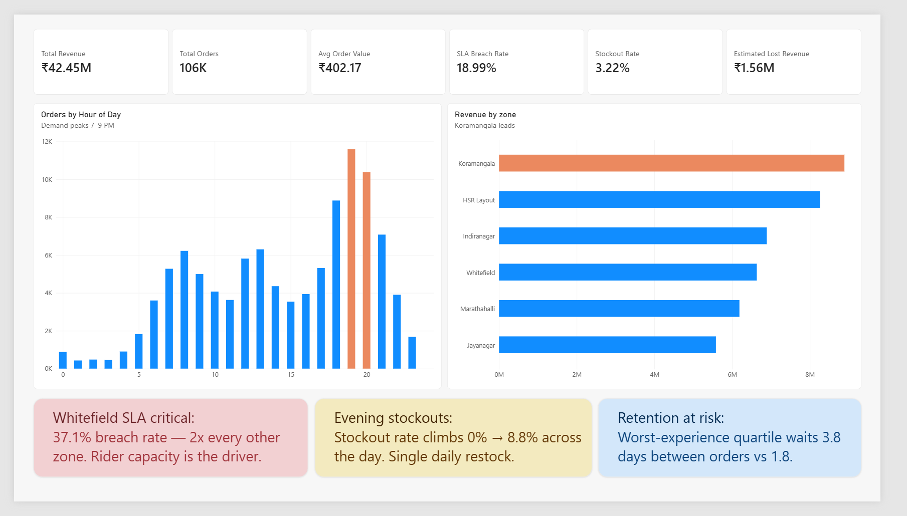
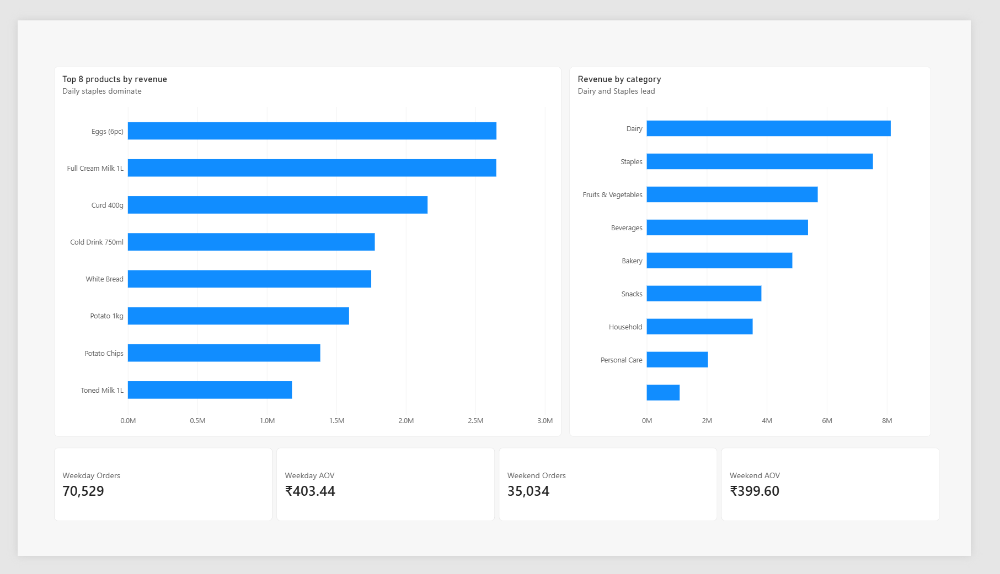
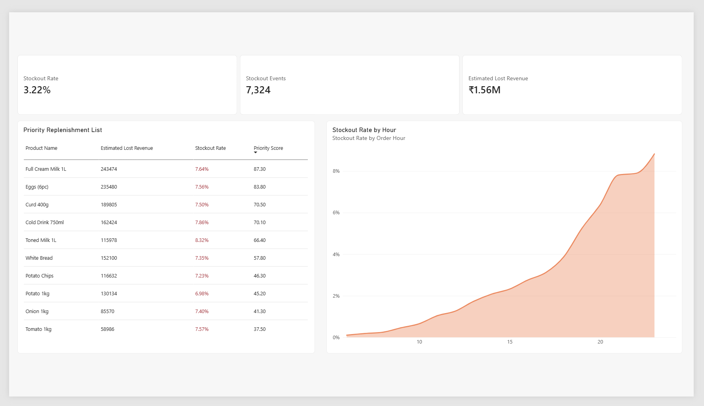
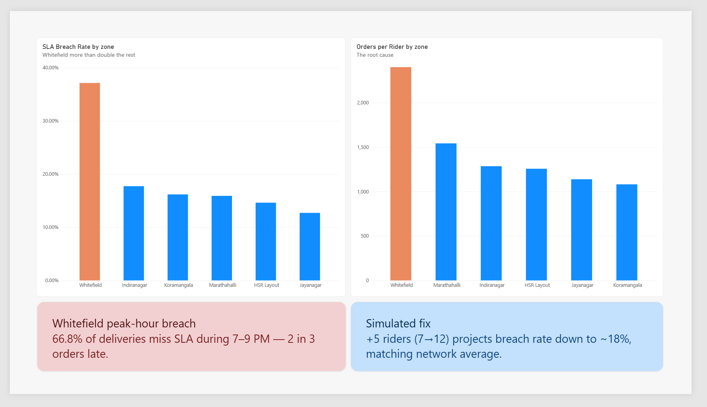
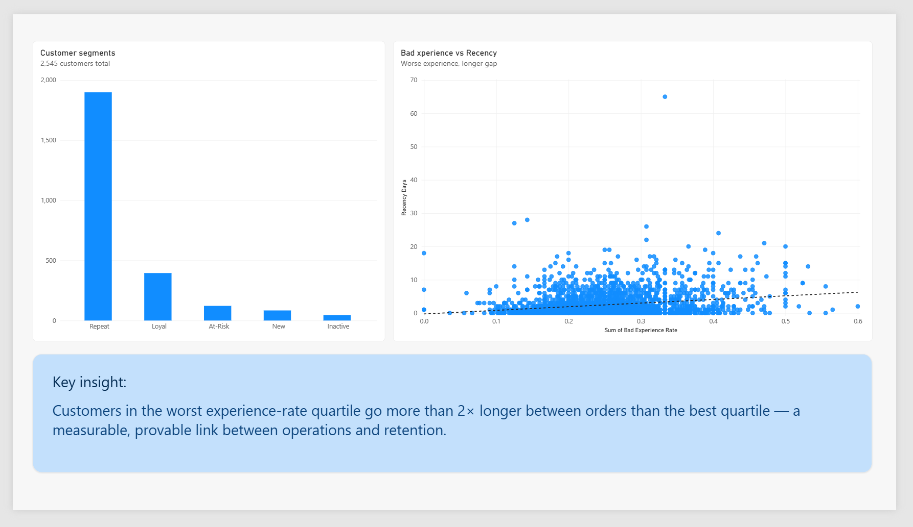

# QuickCart IQ — Quick Commerce Operations & Revenue Intelligence Platform

An end-to-end analytics project diagnosing revenue leakage and operational bottlenecks for a simulated quick-commerce grocery delivery company, using SQL, Python, and Power BI.

## The business problem

*Which locations and products are causing lost revenue, late deliveries, and customer churn — and what should the operations team do about it?*

Three findings drive this project:
1. **Stockouts cost an estimated ₹15.6L** in lost revenue, concentrated in a handful of high-demand products and worsening through the day as single-daily restocking drains stock.
2. **One delivery zone (Whitefield) has a 37.1% SLA breach rate** — more than double every other zone — explained by a quantifiable rider-capacity shortfall (2,399 orders/rider vs. 1,081 in the best-performing zone).
3. **Bad operational experiences measurably predict customer churn** — customers with the worst experience rate go more than 2× longer between orders than customers with the best.

Full write-up: [`docs/business_recommendations.md`](docs/business_recommendations.md)

## Data note

This dataset is **synthetically generated**, not scraped or sourced from a real company. No public dataset exists with the multi-table structure this project needed (orders + inventory + delivery + customers, all linked) — that data is internal to companies and never publicly exposed. The synthetic data was built to realistically mimic a real company's database, including intentional data-quality issues (inconsistent text casing, duplicate rows, missing values, boolean-encoding bugs) that had to be found and cleaned as part of the analysis — see the cleaning steps in `sql/03_clean_data.sql` for specifics.

**Scale:** ~440,000 rows across 8 linked tables — customers, dark stores, products, delivery partners, orders, order items, delivery events, inventory snapshots. 4 months simulated (Feb–May 2026), 6 zones across Bangalore.

## Tech stack

- **MySQL 8.0** — database design, cleaning, and business-question analysis
- **Python** (pandas, matplotlib, numpy) — deeper analysis, the priority-scoring model, and the decision simulator (linear regression)
- **Power BI** — 5-page interactive dashboard with DAX measures

## Repo structure

```
quickcart-iq/
├── README.md                          — this file
├── sql/
│   ├── 00_full_setup.sql              — builds the database and loads all data
│   ├── 03_clean_data.sql              — cleans duplicates, text casing, missing values
│   ├── 04_demand_analysis.sql         — demand & sales business questions
│   ├── 05_stockout_analysis.sql       — stockout & lost revenue business questions
│   ├── 06_sla_analysis.sql            — delivery & SLA business questions
│   ├── 07_rfm_analysis.sql            — customer retention (RFM) business questions
│   ├── 08_export_for_python.sql       — export queries used for the Python phase
│   └── 09_export_for_powerbi.sql      — export queries used for the Power BI phase
├── python/
│   ├── quickcart_analysis.py          — priority scoring, RFM charts, decision simulator
│   └── charts/                        — output charts (PNG)
├── powerbi/
│   └── (add your .pbix file and dashboard screenshots here)
├── data/
│   └── README.md                      — data dictionary
└── docs/
    └── business_recommendations.md    — full findings and recommendations
```

## How to reproduce

1. **Database**: install MySQL, create a database called `quickcart`, run `sql/00_full_setup.sql` (you'll need the source CSVs — see `data/README.md`), then `sql/03_clean_data.sql`.
2. **SQL analysis**: run `sql/04` through `07` to reproduce every business-question finding.
3. **Python analysis**: run `sql/08_export_for_python.sql`, export each query's results as CSV, then run `python/quickcart_analysis.py` in the same folder as those CSVs.
4. **Power BI**: run `sql/09_export_for_powerbi.sql`, export all 8 tables as CSV, load them into Power BI Desktop, and rebuild the relationships described below.

## Data model (Power BI relationships)

```
customers ---< orders >--- dark_stores
                 |
                 |---< order_items >--- products
                 |
                 '---< delivery_events >--- delivery_partners

inventory_snapshots --- dark_stores, products
```

## The decision simulator

Rather than just reporting "Whitefield has a problem," this project quantifies it: a linear regression between rider capacity and SLA breach rate across all 6 zones (R² = 0.90) is used to simulate the impact of adding riders to the understaffed zone — projecting a drop from 37% to ~18% breach rate with 5 additional riders. See `python/quickcart_analysis.py` and `python/charts/chart4_decision_simulator.png`.

## Dashboard

5-page Power BI dashboard: Executive Overview, Demand & Sales, Inventory & Lost Revenue, Delivery Operations, Customer Intelligence.

### Page 1 — Executive Overview


### Page 2 — Demand & Sales


### Page 3 — Inventory & Lost Revenue


### Page 4 — Delivery Operations


### Page 5 — Customer Intelligence


The full `.pbix` file is in [`powerbi/QuickCart_IQ_Dashboard.pbix`](powerbi/QuickCart_IQ_Dashboard.pbix).

---

*Built as a portfolio project for Data/Business Analyst roles.*
